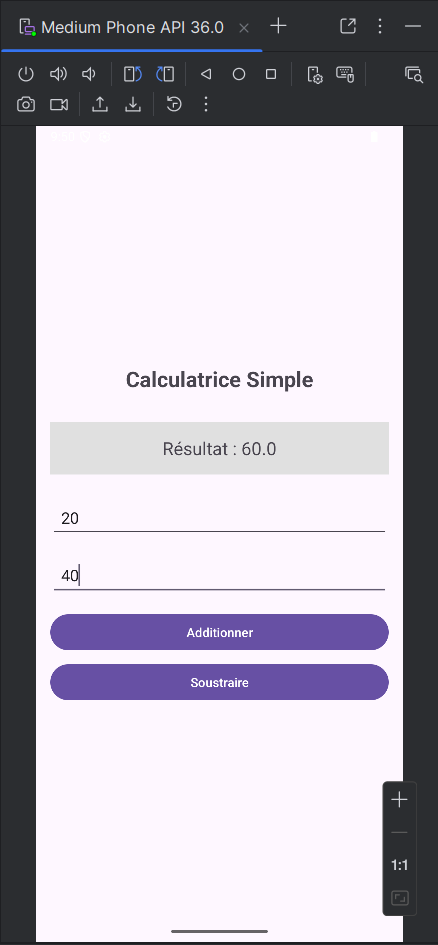
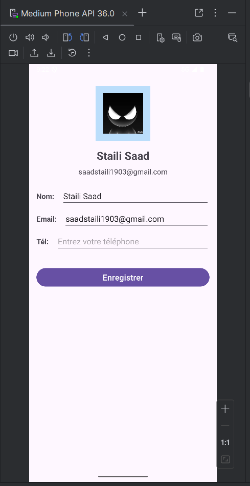
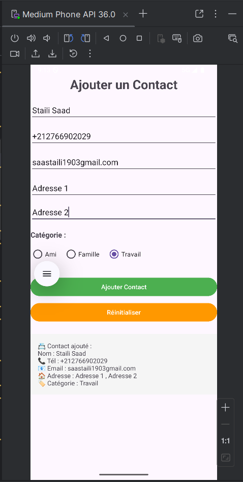

# Atelier Android – Interfaces Utilisateur

## 👤 Étudiant
- **Nom :** Staili Saad
- **Étude :** ISTA NTIC SAFI
- **Année :** 2024/2025

## 📱 Travaux Réalisés
| Exercice | Layout | Fonctionnalités | Statut |
|---------|--------|----------------|--------|
| Calculatrice | LinearLayout | Addition & Soustraction, Validation | ✅ Terminé |
| Profil Utilisateur | ConstraintLayout | Mise à jour d’un profil | ✅ Terminé |
| Application Contact | ConstraintLayout + RadioGroup | Ajout, Affichage, Réinitialisation | ✅ Terminé |

## 🖼 Captures d'écran
### Calculatrice

### Profil Utilisateur

### Challenge Contact

## 💡 Compétences Acquises
- Utilisation avancée de **LinearLayout** et **ConstraintLayout**
- Gestion des **Widgets** (TextView, EditText, Button, RadioGroup)
- Manipulation d’événements et fonctions en **Kotlin**
- Gestion de version avec **Git & GitHub** 

## 🚀 Lancement du projet
Ouvrir avec **Android Studio** → **Run ►**
